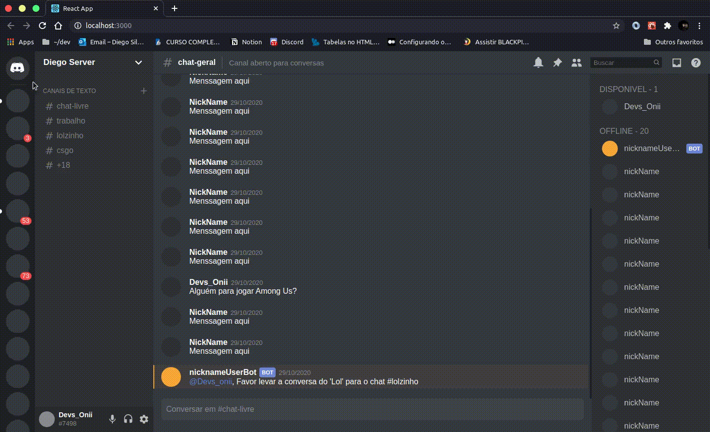

<h4 align="center">
	
</h4>

<p align="center">
 <a href="#-sobre-o-projeto">Sobre</a> •
 <a href="#-layout">Layout</a> • 
 <a href="#-como-executar-o-projeto">Como executar</a> • 
 <a href="#-tecnologias">Tecnologias</a> • 
 <a href="#-autor">Autor</a> • 
 <a href="#user-content--licença">Licença</a>
</p>


## 💻 Sobre o projeto

Discord - E uma plataforma de entreterimento voltada pricipalmente para games, onde os usuários podem conectar a um certo servidor da sua preferência e que contém pessoas com os mesmo interesses que o seu podendo conversar em chat, video chamada e Call, compartilhando iteresse comums. O projeto consiste no clone da interface de usuário web.

---

## 🎨 Layout

O layout recriado do [**Discord**](https://discord.com)



---

## 🚀 Como executar o projeto

O Projeto contem somente o Frontend ja que se trata apenas do layout-clone

#### 🧭 Rodando a aplicação web (Frontend) na sua maquina

```bash

# Clone este repositório
$ git clone https://github.com/Diego-DevsS/UI-Discord

# Acesse a pasta do projeto no seu terminal/cmd
$ cd UI-Discord

# Instale as dependências
$ yarn install

# Execute a aplicação em modo de desenvolvimento
$ yarn start

# A aplicação será aberta na porta:3000 - acesse http://localhost:3000

```
ou penas click aqui para execultar a apliacação

[](https://ui-discord.diego-devss.vercel.app/)
---

## 🛠 Tecnologias

As seguintes ferramentas foram usadas para clona o Ui-clone:

#### **Website**  ([React](https://reactjs.org/)  +  [TypeScript](https://www.typescriptlang.org/))

-   **[React Icons](https://react-icons.github.io/react-icons/)**
-   **[React Native](https://react.com____)**

> Veja o arquivo  [package.json](https://github.com/Dev-DC-Silva/UI-Discord/blob/main/package.json)


#### **Utilitários**

-   Editor:  **[Visual Studio Code](https://code.visualstudio.com/)**

---

## 💪 Como contribuir para o projeto

1. Faça um **fork** do projeto.
2. Crie uma nova branch com as suas alterações: `git checkout -b my-feature`
3. Salve as alterações e crie uma mensagem de commit contando o que você fez: `git commit -m "feature: My new feature"`
4. Envie as suas alterações: `git push origin my-feature`
> Caso tenha alguma dúvida confira este [guia de como contribuir no GitHub](./CONTRIBUTING.md)

---

## 🦸 Autor

[](https://www.instagram.com/dcdevs/)
[](https://www.linkedin.com/in/diego-c-silva-487b171a5/)<br>
[](https://twitter.com/DiegoSi06829718)
[]()

---

## 📝 Licença

Este projeto esta sobe a licença [MIT](https://github.com/Diego-DevsS/UI-Discord/blob/main/LICENCE).

Feito por ❤️ Diego Silva 👋🏽 [Entre em contato!](https://www.linkedin.com/in/diego-caetano-487b171a5/)

---
